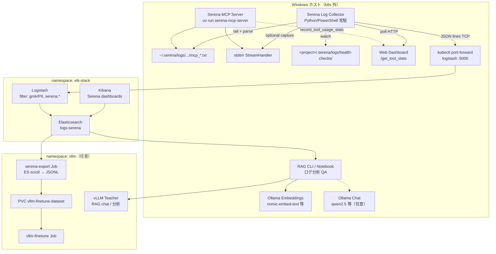
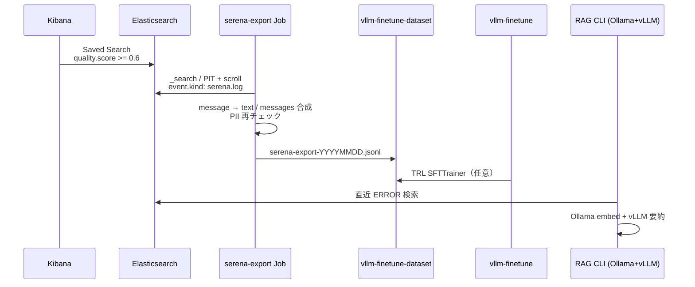
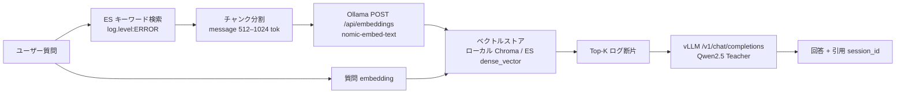

# ELK Stack × Serena MCP ログ収集 × LLM 学習連携 統合設計

> 作成日: 2026-06-11  
> ステータス: **P1/P2 実装済み**（ES テンプレート + Logstash + Collector + Export + RAG CLI）  
> 対象リポジトリ: `kubernetes/`（`elk-stack/`）+ ホスト側 Serena MCP（`serena/`、k8s 外）

---

## チーム役割と実施内容

| 役割 | 実施内容 |
|------|----------|
| **Architect** | Serena MCP（Windows ローカル、stdio/SSE）と ELK（k8s `elk-stack` 名前空間）の境界を定義。Serena は **Pod 化しない**前提で、ホスト側 Collector が 4 ストリーム（MCP ファイルログ、stderr、health-check、tool stats）を **構造化 JSON** に正規化し、既存 Logstash `tcp:5000` JSON 経路へ送る。検索用インデックス `logs-serena` を `logstash-*` / `logs-vllm-distill` から分離。学習データは ES → JSONL エクスポート → `vllm-finetune-dataset` PVC またはローカル `dataset/`。RAG は Ollama embeddings + vLLM chat の二段構成。 |
| **DevOps/SRE** | Windows ホスト Collector（PowerShell 常駐 or Python サービス）、`kubectl port-forward` で Logstash TCP 5000 を `0.0.0.0:5000` に公開（`start-elk-portforward.ps1` 拡張）。Filebeat は Serena ログに **非推奨**（パスがホスト `~/.serena` とプロジェクト `.serena` に分散）。ILM（kind 7 日 / kubeadm 30 日）、NetworkPolicy は **k8s 内のみ**（export Job → ES）。Runbook と `elk-stack/design/` スケッチを整備。 |
| **ML Engineer** | Serena ログから fine-tuning / RAG 用コーパスを定義。JSONL 形式は `{"text": "..."}`（`train_lora.py` 互換）と `{"messages": [...]}`（チャット SFT）の 2 系統。ツール呼び出しペア（input/output）を `serena.tool.*` から抽出。品質フィルタ（ERROR 除外オプション、重複セッション、短すぎるメッセージ）。RAG 用は `message` + `serena.logger` + `serena.project` を chunk 化し Ollama `nomic-embed-text` 等でベクトル化、vLLM Teacher で要約・異常検知 QA。 |
| **Adversarial Critic（反証）** | ホストログにソースコード断片・API キー・ユーザーパスが混在するリスクを強調。ELK 全量収集はディスク・PII・運用コストの観点で過剰になりうる。**MVP は MCP ファイルログ + 構造化メタのみ**、フルテキストは hash / 長さ上限付き。stderr は MCP クライアント（Cursor）経由で重複するため単独の正本にしない。 |
| **Synthesizer** | **推奨: ハイブリッド** — 運用検索・ダッシュボードは ELK、学習正本は JSONL on PVC/ローカル、RAG ベクトルは Ollama ローカル + 任意で ES `dense_vector`（Full）。vLLM 蒸留パイプライン（`docs/design/elk-stack-vllm-distillation.md`）と **同一 Logstash TCP 経路・同一 export パターン** を再利用し、Serena 専用フィルタとインデックスのみ追加。 |

### Ollama ブレインストーミング

- **使用**: `ollama list` でモデル確認後、`qwen2.5:1.5b` に Architect / Critic 視点で「Windows ローカル MCP ログを k8s ELK に送る」案を照会。
- **所見**: 汎用案（Filebeat、Fluent Bit）は得られたが、`stdio` MCP の stdout 禁止制約や Serena の `SERENA_LOG_FORMAT` 固有パースには未言及。**最終設計は `serena/src/serena/cli.py` のロギング実装を優先**し、Ollama 出力は反証チェックリストの補助に留める。

### Byterover CLI

- **retrieve (`brv query`)**: 環境依存。本設計は `serena/` ソースと `elk-stack/` マニフェストの直接調査に基づく。

---

## 背景と目的

### 現状

| コンポーネント | 状態 |
|----------------|------|
| **Serena MCP** | Windows ホストで `uv run serena-mcp-server`（Cursor MCP 設定）。k8s 未デプロイ |
| **Serena ログ（ファイル）** | `~/.serena/logs/<YYYY-MM-DD>/mcp_<datetime>.txt`（セッションごとに新規ファイル、`mode="w"`） |
| **Serena ログ（stderr）** | 同一フォーマットで MCP クライアントがキャプチャ可能（`StreamHandler(sys.stderr)`） |
| **Health-check ログ** | `<project>/.serena/logs/health-checks/health_check_<datetime>.log`（`serena health-check` 実行時） |
| **Tool stats** | `record_tool_usage_stats: true` 時のみ。メモリ上 + Web Dashboard API `/get_tool_stats`（永続ファイルなし） |
| **ログフォーマット** | `SERENA_LOG_FORMAT = "%(levelname)-5s %(asctime)-15s [%(threadName)s] %(name)s:%(funcName)s:%(lineno)d - %(message)s"` |
| **elk-stack/** | ES 9.2.3、Logstash `tcp/udp:5000` JSON、既存 `vllm-distill` パイプライン実装済み（参照パターン） |
| **LLM 学習** | `vllm/components/finetune/` — `train.jsonl`（`{"text":"..."}`）TRL SFT |
| **Ollama** | Windows ローカル推論・ベンチ（`scripts/setup-ollama-rx5700.ps1` 等） |
| **Serena × ELK 連携** | **未実装** |

### 目的

1. Serena MCP の **全ログストリーム** を ELK で横断検索可能にする（セッション障害、ツール失敗、LSP エラーのトリアージ）。
2. 蓄積ログから **JSONL コーパスをエクスポート**し、Ollama / vLLM による fine-tuning または評価データセットを生成する。
3. エクスポート済みコーパスを **RAG**（Ollama embedding + vLLM chat）で「ログ分析アシスタント」として利用する。

ELK は **検索・品質ゲート・監査** に使い、学習データの長期正本は JSONL / PVC とする（vLLM 蒸留設計と同趣旨）。

---

## アーキテクチャ



### 設計原則

1. **ホストファースト**: Serena は k8s に入れない。Collector は Windows サービス/Task Scheduler で動かす。
2. **インデックス分離**: Serena イベントは `logs-serena`（またはデータストリーム `logs-serena-*`）。`logstash-*` と混在しない。
3. **構造化ファースト**: プレーンログ行は Collector 側でパースし JSON 化してから Logstash へ送る（grok 依存を最小化）。
4. **既存 ELK を拡張**: vLLM distill と同じ `tcp:5000` + Logstash filter 分岐パターンを踏襲。
5. **stdout は収集しない**: MCP プロトコル専用のため `cli.py` コメント通り対象外。

---

## ログソース（4 ストリーム）

### ストリーム一覧

| # | ストリーム ID | 物理パス / 発生源 | 収集方法 | イベント `serena.stream` |
|---|---------------|-------------------|----------|---------------------------|
| 1 | **mcp_file** | `%USERPROFILE%\.serena\logs\<date>\mcp_*.txt` | tail + rotate 検知（新ファイル） | `mcp.file` |
| 2 | **mcp_stderr** | MCP 子プロセス stderr（Cursor 起動時） | Collector が Serena をラップしない場合 **optional**；Cursor ログ転送 or ローカルデバッグ時のみ | `mcp.stderr` |
| 3 | **health_check** | `<project>\.serena\logs\health-checks\health_check_*.log` | `FileSystemWatcher`（複数プロジェクトルートを設定） | `health_check` |
| 4 | **tool_stats** | Dashboard `GET /get_tool_stats` | `record_tool_usage_stats: true` 前提で定期ポーリング（例: 60s） | `tool_stats` |

### ログ行パース（ストリーム 1・2・3 共通）

Serena は Python `logging` の単一行テキストを出力する。

**正規表現（grok 互換）:**

```
^(?<log.level>[A-Z]+)\s+(?<log.timestamp>\d{4}-\d{2}-\d{2} \d{2}:\d{2}:\d{2},\d{3})\s+\[(?<log.thread>[^\]]+)\]\s+(?<log.logger>[^:]+):(?<log.function>[^:]+):(?<log.line>\d+)\s+-\s+(?<message>.*)$
```

**パース後マッピング例:**

| 生フィールド | ES フィールド |
|--------------|---------------|
| `log.level` | `log.level`（keyword） |
| `log.timestamp` | `@timestamp`（JST/UTC は Collector で統一） |
| `log.thread` | `log.thread` |
| `log.logger` | `serena.logger` |
| `log.function` | `serena.function` |
| `log.line` | `serena.line`（integer） |
| `message` | `message`（text） |

### ストリーム 4: tool_stats JSON スキーマ

Dashboard API 応答（`ToolUsageStats.get_tool_stats_dict()`）を 1 ツール = 1 イベントに展開。

```json
{
  "@timestamp": "2026-06-11T10:00:00.000Z",
  "event": { "kind": "serena.log" },
  "serena": {
    "stream": "tool_stats",
    "project": "d:\\work\\kubernetes",
    "host": "DESKTOP-EXAMPLE",
    "session_id": "mcp_20260611-100000",
    "tool": {
      "name": "find_symbol",
      "num_times_called": 12,
      "input_tokens": 4500,
      "output_tokens": 8900
    },
    "token_estimator": "tiktoken_gpt4o"
  }
}
```

### 収集しないもの（デフォルト）

- MCP **stdout**（JSON-RPC トラフィック）
- `~/.serena/serena_config.yml` の秘密情報
- Tool stats の **生 input/output 全文**（トークン数のみ MVP）
- ユーザーホームディレクトリのフルパス（`serena.project_hash` への置換オプション）

---

## インジェスト経路

### 推奨: ホスト Collector → port-forward → Logstash TCP JSON

既存 `elk-stack/logstash-configmap.yaml` は **tcp/udp port 5000 + json codec** を公開済み。

```
Windows Serena Log Collector
  → localhost:5000 (kubectl port-forward svc/logstash 5000:5000 -n elk-stack --address=0.0.0.0)
  → Logstash filter（PII マスク、serena.* 正規化）
  → Elasticsearch index: logs-serena
```

**Collector 実装イメージ**（将来パス）:

- `elk-stack/design/serena-collector/` — Python 3.11+、`watchdog` + `aiohttp`（TCP 送信）
- 設定: `%USERPROFILE%\.serena\collector-config.yml`（プロジェクトルート一覧、Logstash エンドポイント、サンプリング率）

**起動手順（開発者端末）:**

```powershell
# 1. ELK port-forward（5000 を追加 — start-elk-portforward.ps1 拡張予定）
kubectl port-forward svc/logstash 5000:5000 -n elk-stack --address=0.0.0.0

# 2. Collector 起動
uv run python elk-stack/design/serena-collector/collector.py --config ~/.serena/collector-config.yml
```

### 代替 A: Filebeat（ホスト）

`C:\Users\<user>\.serena\logs\**\*.txt` を tail。

- **利点**: Beat エコシステム、バックプレッシャー  
- **欠点**: 行パースが Logstash 側に寄る、health-check はプロジェクトごとに複数パス、tool stats は取得不可、**Critic 推奨度低**

### 代替 B: rsyslog / syslog（UDP 514）

既存 Raspberry Pi 連携パターン。Windows から syslog 送信は追加コンポーネントが必要。

- **利点**: `start-elk-portforward.ps1` で 514 転送済み  
- **欠点**: 構造化 JSON を syslog メッセージに埋め込むオーバーヘッド、**MVP には不適**

### 代替 C: Serena 本体に TCP Handler 追加（upstream PR）

`Logger.root.addHandler(TcpJsonHandler)` を `cli.py` に追加。

- **利点**: リアルタイム性最高、Collector 不要  
- **欠点**: Serena フォーク/PR 依存、MCP 起動パス変更、**Full フェーズで検討**

### 採用判断

| 経路 | MVP | Full |
|------|-----|------|
| ホスト Collector → TCP 5000 | ✅ 主経路 | ✅ |
| Filebeat ホスト | ❌ | △ 補助 |
| syslog/514 | ❌ | ❌ |
| Serena 内蔵 TCP Handler | ❌ | △ upstream マージ後 |

---

## Elasticsearch スキーマ

- **インデックス名**: `logs-serena`（パターン `logs-serena-*` または data stream `logs-serena`）
- **識別子**: `event.kind = serena.log`（必須）
- **テンプレート**: `elk-stack/design/serena-index-template.json`（スケッチ、新規作成予定）
- **ILM ポリシー**（kubeadm）:
  - hot: 7 日
  - delete: 30 日
- **kind overlay**: hot 3 日 / delete 7 日、DEBUG サンプリング 50%

`dynamic: strict` を推奨（フィールド爆発防止）。`message` にコード断片が入るため `index: true` だが、export 時に長さ上限をかける。

### MVP 必須フィールド

| フィールド | 型 | 説明 |
|------------|-----|------|
| `@timestamp` | date | イベント時刻 |
| `event.kind` | keyword | 常に `serena.log` |
| `serena.stream` | keyword | `mcp.file` / `mcp.stderr` / `health_check` / `tool_stats` |
| `serena.session_id` | keyword | ログファイル名由来 `mcp_20260523-081256` |
| `serena.project` | keyword | プロジェクトルート（または hash） |
| `serena.host` | keyword | Windows ホスト名 |
| `serena.version` | keyword | Serena バージョン（ログ行から抽出可能時） |
| `log.level` | keyword | DEBUG / INFO / WARNING / ERROR / CRITICAL |
| `log.thread` | keyword | MainThread 等 |
| `serena.logger` | keyword | 例: `serena.agent` |
| `serena.function` | keyword | 例: `start_mcp_server` |
| `serena.line` | integer | ソース行番号 |
| `message` | text | ログ本文（**redacted 後**） |
| `serena.message_hash` | keyword | SHA-256（重複排除・学習用） |
| `serena.quality.score` | float | 0–1（ルールベース） |
| `serena.quality.flags` | keyword[] | `too_short`, `duplicate`, `contains_path`, `error_level` 等 |
| `serena.exported` | boolean | JSONL エクスポート済みフラグ（Full） |
| `host.os.type` | keyword | `windows` |

### Full 設計（任意拡張）

| フィールド | 説明 |
|------------|------|
| `serena.tool.name` | tool_stats / ツール呼び出しログ用 |
| `serena.tool.input_tokens` | integer |
| `serena.tool.output_tokens` | integer |
| `serena.lsp.language` | 言語サーバー種別 |
| `serena.mcp.transport` | `stdio` / `sse` |
| `serena.mcp.client` | `cursor` / `claude-desktop` 等（環境変数から） |
| `serena.trace.lsp` | boolean（`trace_lsp_communication` 時の関連ログにタグ） |
| `serena.embedding` | dense_vector（RAG 用、ES 内ベクトル検索） |
| `serena.rag.chunk_id` | RAG chunk 参照 |

### インデックステンプレートスケッチ

```json
{
  "index_patterns": ["logs-serena-*"],
  "template": {
    "settings": {
      "number_of_shards": 1,
      "number_of_replicas": 0,
      "index.codec": "best_compression"
    },
    "mappings": {
      "dynamic": "strict",
      "properties": {
        "@timestamp": { "type": "date" },
        "event": {
          "properties": {
            "kind": { "type": "keyword" }
          }
        },
        "log": {
          "properties": {
            "level": { "type": "keyword" },
            "thread": { "type": "keyword" }
          }
        },
        "serena": {
          "properties": {
            "stream": { "type": "keyword" },
            "session_id": { "type": "keyword" },
            "project": { "type": "keyword" },
            "host": { "type": "keyword" },
            "version": { "type": "keyword" },
            "logger": { "type": "keyword" },
            "function": { "type": "keyword" },
            "line": { "type": "integer" },
            "message_hash": { "type": "keyword" },
            "quality": {
              "properties": {
                "score": { "type": "float" },
                "flags": { "type": "keyword" }
              }
            },
            "exported": { "type": "boolean" },
            "tool": {
              "properties": {
                "name": { "type": "keyword" },
                "num_times_called": { "type": "integer" },
                "input_tokens": { "type": "integer" },
                "output_tokens": { "type": "integer" }
              }
            }
          }
        },
        "message": { "type": "text" },
        "host": {
          "properties": {
            "os": {
              "properties": {
                "type": { "type": "keyword" }
              }
            }
          }
        }
      }
    }
  }
}
```

---

## Logstash フィルタ（追加案）

`logstash-configmap.yaml` の `filter { }` に vLLM distill ブロックと並列で追加:

```ruby
# serena イベント（Collector -> tcp/5000 JSON）
if [event][kind] == "serena.log" {
  mutate {
    add_tag => [ "serena" ]
    remove_field => [ "@version", "host", "type" ]
  }

  # PII / パスマスク
  mutate {
    gsub => [
      "message", "[A-Za-z]:\\Users\\[^\\s]+", "[USER_HOME]",
      "message", "[A-Za-z]:\\[^\\s]+", "[PATH]"
    ]
  }

  ruby {
    code => '
      score = 1.0
      flags = []
      msg = event.get("message").to_s
      if msg.length < 20
        score -= 0.3
        flags << "too_short"
      end
      if event.get("[log][level]") == "ERROR"
        flags << "error_level"
      end
      if msg =~ /api[_-]?key|password|secret/i
        score -= 0.8
        flags << "sensitive_pattern"
      end
      require "digest"
      event.set("[serena][message_hash]", Digest::SHA256.hexdigest(msg))
      event.set("[serena][quality][score]", [score, 0.0].max)
      event.set("[serena][quality][flags]", flags) unless flags.empty?
      event.set("[serena][exported]", false)
    '
  }
}
```

```ruby
# output 分岐
if "serena" in [tags] {
  elasticsearch {
    hosts => ["elasticsearch:9200"]
    index => "logs-serena"
    action => "create"
  }
}
```

---

## エクスポートパイプライン（ES → 学習 JSONL）



### JSONL 変換ルール

#### パターン A: `train_lora.py` 互換（単一 text）

ツール実行ログやエージェント思考ログを「指示 → 応答」形式に整形:

```json
{"text": "<|im_start|>system\nSerena MCP session log\n\n<|im_start|>user\n[ERROR] find_symbol failed in project kubernetes\n\n<|im_start|>assistant\nRoot cause: language server timeout after 240s …\n\n"}
```

#### パターン B: チャット messages（評価・蒸留連携）

```json
{
  "messages": [
    {"role": "system", "content": "You analyze Serena MCP logs."},
    {"role": "user", "content": "ログ: serena.agent:_update_active_tools:397 - Active tools (25): …"},
    {"role": "assistant", "content": "このセッションでは 25 ツールが有効化されています。…"}
  ],
  "meta": {
    "session_id": "mcp_20260523-081256",
    "stream": "mcp.file",
    "quality_score": 0.85
  }
}
```

#### パターン C: tool_stats 集計（Full）

```json
{"text": "Tool find_symbol: called 12 times, avg input 375 tokens, output 741 tokens in session mcp_20260611."}
```

### エクスポート Job スケッチ

`elk-stack/design/serena-export-job.yaml.example` — vLLM `distill-export` と同型:

- CronJob `serena-export`（`suspend: true`、手動トリガ）
- Query: `event.kind: serena.log AND serena.quality.score >= 0.6 AND NOT serena.quality.flags: sensitive_pattern`
- 出力: `/data/dataset/serena-export-YYYYMMDD.jsonl`
- ローカル開発: PowerShell `scripts/export-serena-logs.ps1` で ES → `.\dataset\` に直接書き出し

---

## RAG 連携（Ollama embeddings + vLLM chat）

### ユースケース

| 用途 | 説明 |
|------|------|
| 障害調査 | 「直近 24h の Serena ERROR で language server 関連を要約」 |
| パターン発見 | 「find_symbol 失敗が多いプロジェクトは？」 |
| 学習データ探索 | 「品質 score 0.8 以上のログからツール使用パターンを抽出」 |
| Fine-tune 前処理 | エクスポート JSONL の重複・品質確認 |

### アーキテクチャ



### 実装スケッチ（ホスト CLI）

```powershell
# 前提: ollama pull nomic-embed-text; vLLM port-forward or ローカル Teacher
uv run python scripts/serena-rag-query.py `
  --es-url http://localhost:9200 `
  --index logs-serena `
  --ollama http://localhost:11434 `
  --vllm http://localhost:8000 `
  --query "直近の health-check 失敗の共通原因は？"
```

**プロンプト設計:**

- System: 「あなたは Serena MCP ログ分析者。根拠として `serena.session_id` と `message` を引用すること。」
- Context: Top-K チャンク（トークン上限 4k）
- 回答に hallucination 抑制: ログに無い推測は「不明」と明示

### Ollama / vLLM 役割分担

| コンポーネント | 役割 | 例 |
|----------------|------|-----|
| **Ollama embeddings** | ログチャンクのベクトル化（ローカル GPU/CPU） | `nomic-embed-text`, `mxbai-embed-large` |
| **Ollama chat**（任意） | 軽量 QA、オフライン検証 | `qwen2.5:1.5b` |
| **vLLM chat** | 高精度要約・長文分析 | `Qwen/Qwen2.5-1.5B-Instruct`（k8s Teacher） |

---

## Kibana ダッシュボード

| パネル | 用途 |
|--------|------|
| ログ量 / 日 × `serena.stream` | ストリーム別取り込み監視 |
| `log.level` 分布 | ERROR/WARNING トレンド |
| `serena.logger` Top 10 | ノイズ源特定 |
| `serena.session_id` ヒートマップ | セッションあたりログ量 |
| `serena.quality.flags` | エクスポート除外理由 |
| Tool stats（Full） | `serena.tool.name` × トークン量 |
| エクスポート済み率 | `serena.exported: true`（Full） |

**Saved Search 例:**

```
event.kind: "serena.log" AND log.level: ("ERROR" OR "WARNING") AND serena.stream: "mcp.file"
```

---

## セキュリティ / PII

| 項目 | 対策 |
|------|------|
| **ソースコード断片** | `message` にファイル内容が含まれうる（`read_file` ログ）。export 時に `serena.logger: serena.tools.*` かつ長さ > 4KB を除外または truncate |
| **ユーザーパス** | Collector / Logstash で `C:\Users\*` → `[USER_HOME]`、プロジェクトパスは設定で hash 化 |
| **API キー / トークン** | 正規表現マスク、`sensitive_pattern` フラグでエクスポート除外 |
| **認証** | ES `xpack.security.enabled=false`（MVP）。P3 で API Key |
| **ネットワーク** | port-forward は開発者端末のみ。本番は VPN 内 Logstash 直結または Beats Gateway |
| **保持** | ILM 自動削除。JSONL も git 管理外（`.gitignore`） |
| **tool_stats** | 生の input/output は ES に載せない（トークン数のみ） |
| **health-check ログ** | プロジェクト名・ファイルパスを含む — マスク必須 |

### `serena_config.yml` 推奨設定（収集時）

```yaml
record_tool_usage_stats: true   # tool_stats ストリーム有効化
log_level: INFO                 # DEBUG はサンプリング（ディスク対策）
```

---

## 反証・リスクと対策（Adversarial Critic）

| # | リスク | 影響 | 対策 |
|---|--------|------|------|
| 1 | **ログにソースコード・秘密が混入** — `read_file` / `execute_shell_command` のログ | 漏洩・学習汚染 | Logstash マスク + export 除外ルール、`message` 長上限 8KB |
| 2 | **インデックス肥大** — MCP セッションごとに大量 DEBUG（LSP trace） | ES ディスク枯渇 | `trace_lsp_communication` は本番収集 off、DEBUG 50% サンプリング、ILM 30 日 |
| 3 | **ホスト Collector SPOF** — Windows 再起動で収集停止 | ログ欠損 | Task Scheduler 自動起動 + バックログ再送（ファイル mtime ベース） |
| 4 | **port-forward 切断** | 取り込み停止 | Collector 側ローカルバッファ（SQLite / ファイルキュー）+ 再接続リトライ |
| 5 | **stderr 重複** — Cursor とファイルログの二重取り込み | ストレージ浪費 | MVP は `mcp.file` のみ必須。stderr は `dedup_hash` で ES ingest pipeline 排除 |
| 6 | **tool_stats 非永続** — Dashboard メモリのみ | 統計欠損 | ポーリング間隔 60s、セッション終了検知でフラッシュイベント送信 |
| 7 | **ELK vs ローカルファイル** — 原文は `~/.serena` に残る | 二重管理 | ELK=検索索引、原文は ILM 削除後もホスト側 90 日保持（別ポリシー） |
| 8 | **学習データ品質** — エラーログばかりが JSONL に | モデル劣化 | `quality.score` 閾値、ERROR のみデータセットは明示ラベル `task: log-analysis` に限定 |
| 9 | **RAG hallucination** — ログに無い原因を捏造 | 誤診断 | 引用必須プロンプト、Top-K 類似度閾値、vLLM temperature 0.2 |
| 10 | **Windows パス区切り** — `\` エスケープで JSON 破損 | 取り込み失敗 | Collector で `pathlib` 正規化、JSON UTF-8 厳格 |

---

## MVP vs Full

| 能力 | MVP | Full |
|------|-----|------|
| 収集ストリーム | `mcp.file` + `health_check` | + `tool_stats` ポーリング、stderr（dedup 付き） |
| 経路 | ホスト Collector → TCP 5000 | + ローカルバッファ、upstream TCP Handler |
| インデックス | 手動テンプレート `logs-serena` | ILM + data stream 自動ロールオーバー |
| 品質 | ルールベース score | + ML 分類（異常検知）、Kibana 手動タグ |
| エクスポート | PowerShell / 手動 Job | CronJob → PVC 自動、`_update_by_query` で exported フラグ |
| RAG | Ollama embed + ローカルスクリプト | + ES `dense_vector`、vLLM Teacher 常時連携 |
| Fine-tune 連携 | JSONL 手動マージ | `vllm-finetune` Job 自動トリガ |
| セキュリティ | 基本マスク | API Key、収集オプトイン（プロジェクト単位） |
| ダッシュボード | Kibana 手動 Discover | 専用 Dashboard JSON |

### MVP の Definition of Done

1. `logs-serena` テンプレートが ES に適用されている  
2. ホスト Collector から 1 MCP セッション分のログが Kibana で `event.kind: serena.log` 検索できる  
3. `health_check` ログ 1 件が `serena.stream: health_check` で検索できる  
4. Export で `serena-export.jsonl` が 50 行以上生成される（品質フィルタ後）  
5. RAG スクリプトで「直近 ERROR 要約」が 1 回成功する（Ollama + vLLM または Ollama のみ）

---

## 実装ロードマップ（提案）

| Phase | 内容 | 触るパス |
|-------|------|----------|
| **P0 設計** | 本ドキュメント + design スケッチ | `docs/design/`, `elk-stack/design/` |
| **P1 MVP** | index template、Logstash serena filter、Collector スクリプト、`port-forward` 5000 追加 | `elk-stack/`, `elk-stack/design/serena-collector/`, `scripts/` |
| **P2 エクスポート + RAG** | export Job/CronJob、JSONL 変換、`serena-rag-query.py` | `elk-stack/design/`, `scripts/`, `vllm/components/`（PVC 共有） |
| **P3 本番 hardened** | ILM、API Key、バッファリング、Kibana Dashboard as code、Argo CD Application | `elk-stack/overlays/kubeadm/`, `argocd/apps/` |

---

## GitHub Issues 分解（6 件）

### Issue 1: `[P1] ES index template + ILM for logs-serena`

**受け入れ条件:**

- [ ] `elk-stack/design/serena-index-template.json` がリポジトリに存在する  
- [ ] `elasticsearch-serena-setup-job.yaml` が `logs-serena` テンプレートと ILM を適用する  
- [ ] `kubectl kustomize elk-stack/overlays/kind` が成功する  
- [ ] `curl localhost:9200/_index_template/logs-serena` で `event.kind` マッピングが確認できる  

---

### Issue 2: `[P1] Logstash filter + output branch for serena.log`

**受け入れ条件:**

- [ ] `logstash-configmap.yaml` に `event.kind == serena.log` 分岐が追加されている  
- [ ] PII マスク（パス・メール）と `serena.quality.score` 計算が動作する  
- [ ] serena イベントが `logs-serena` に、それ以外が従来どおり `logstash-*` に入る  
- [ ] `scripts/test-serena-mock-ingest.sh` でモック JSON 1 件の ingest が成功する  

---

### Issue 3: `[P1] Windows Serena Log Collector (mcp.file + health_check)`

**受け入れ条件:**

- [ ] `elk-stack/design/serena-collector/collector.py` が `SERENA_LOG_FORMAT` をパースして JSON 化する  
- [ ] `~/.serena/logs/**/mcp_*.txt` の tail とローテーション検知が動作する  
- [ ] 設定ファイルで複数 `<project>/.serena/logs/health-checks/` を監視できる  
- [ ] Logstash TCP 5000 へ送信成功（port-forward 経由で Kibana に表示）  
- [ ] README に Task Scheduler 登録手順がある  

---

### Issue 4: `[P1] start-elk-portforward.ps1 — add Logstash TCP 5000`

**受け入れ条件:**

- [ ] `kubectl port-forward svc/logstash 5000:5000 -n elk-stack --address=0.0.0.0` がスクリプトに含まれる  
- [ ] ファイアウォールルール（TCP 5000）のオプション作成がある  
- [ ] 既存 514/5601/9200 転送と共存できる  
- [ ] README（`elk-stack/README.md`）に Serena 連携セクションが追加されている  

---

### Issue 5: `[P2] serena-export Job — ES to JSONL for fine-tuning`

**受け入れ条件:**

- [ ] `elk-stack/design/serena-export-job.yaml.example` が実装に昇格している  
- [ ] `event.kind: serena.log` + `quality.score >= 0.6` で scroll エクスポートできる  
- [ ] 出力が `train_lora.py` 互換 `{"text":"..."}` 形式を含む  
- [ ] kind overlay では CronJob `suspend: true`、手動 Job で 50+ 行生成を確認  
- [ ] エクスポート後 `serena.exported: true` 更新（Full なら必須、MVP は doc 記載で可）  

---

### Issue 6: `[P2] RAG log analysis CLI — Ollama embeddings + vLLM chat`

**受け入れ条件:**

- [ ] `scripts/serena-rag-query.py`（または同等）が ES からログを取得して QA できる  
- [ ] Ollama `/api/embeddings` でチャンクベクトル化が動作する  
- [ ] vLLM（または Ollama chat フォールバック）で要約回答を生成する  
- [ ] 回答に `serena.session_id` の引用が含まれる  
- [ ] `docs/design/elk-stack-serena-logs-llm.md` の RAG セクションに実行例がある  

---

## 参考（リポジトリ内・関連）

| リソース | パス |
|----------|------|
| vLLM 蒸留設計（パターン元） | `docs/design/elk-stack-vllm-distillation.md` |
| Logstash TCP 5000 | `elk-stack/logstash-configmap.yaml` |
| vLLM distill テンプレート | `elk-stack/design/vllm-distill-index-template.json` |
| distill export 例 | `elk-stack/design/distill-export-job.yaml.example` |
| port-forward スクリプト | `elk-stack/start-elk-portforward.ps1` |
| Serena MCP ロギング | `serena/src/serena/cli.py`（`start_mcp_server`） |
| ログフォーマット定数 | `serena/src/serena/constants.py`（`SERENA_LOG_FORMAT`） |
| health-check | `serena/src/serena/cli.py`（`health_check`） |
| tool stats | `serena/src/serena/analytics.py`（`ToolUsageStats`） |
| Fine-tune JSONL | `vllm/components/finetune/` |
| Ollama ローカル GPU | `docs/LOCAL_GPU_SETUP_WINDOWS.md` |
| Argo CD ELK | `argocd/apps/elk-stack-app.yaml` |

---

## デプロイ手順（P1 想定）

### 1. ELK（Serena テンプレート + Logstash filter）

```bash
# kind
kubectl apply -k elk-stack/overlays/kind/
kubectl wait --for=condition=complete job/elasticsearch-serena-setup -n elk-stack --timeout=300s
kubectl rollout restart deployment/logstash -n elk-stack

# kubeadm
kubectl apply -k elk-stack/overlays/kubeadm/
```

### 2. port-forward（Windows）

```powershell
.\elk-stack\start-elk-portforward.ps1
# または手動
kubectl port-forward svc/logstash 5000:5000 -n elk-stack --address=0.0.0.0
```

### 3. Serena Collector（Windows）

```powershell
# serena_config.yml で record_tool_usage_stats: true（任意）
uv run python elk-stack/design/serena-collector/collector.py `
  --logstash localhost:5000 `
  --projects "d:\work\kubernetes","d:\work\serena"
```

### 4. 確認

```powershell
kubectl port-forward svc/elasticsearch 9200:9200 -n elk-stack
curl "http://localhost:9200/logs-serena/_search?q=event.kind:serena.log&size=3&pretty"
```

### 5. Export（P2）

```bash
kubectl create job -n vllm --from=cronjob/serena-export serena-export-manual-$(date +%s)
kubectl logs -f job/serena-export-manual-... -n vllm
```

### 6. RAG クエリ（P2）

```powershell
ollama pull nomic-embed-text
uv run python scripts/serena-rag-query.py --query "直近24時間の ERROR を要約"
```

---

## 付録: Collector 出力 JSON 例（mcp.file）

```json
{
  "@timestamp": "2026-05-23T08:12:56.701Z",
  "event": { "kind": "serena.log" },
  "serena": {
    "stream": "mcp.file",
    "session_id": "mcp_20260523-081256",
    "project": "d:\\work\\kubernetes",
    "host": "DESKTOP-EXAMPLE",
    "version": "0.1.3",
    "logger": "serena.cli",
    "function": "start_mcp_server",
    "line": 166
  },
  "log": {
    "level": "INFO",
    "thread": "MainThread"
  },
  "message": "Initializing Serena MCP server",
  "host": { "os": { "type": "windows" } }
}
```

---

## 変更履歴

| 日付 | 内容 |
|------|------|
| 2026-06-11 | 初版（P0 設計） |
