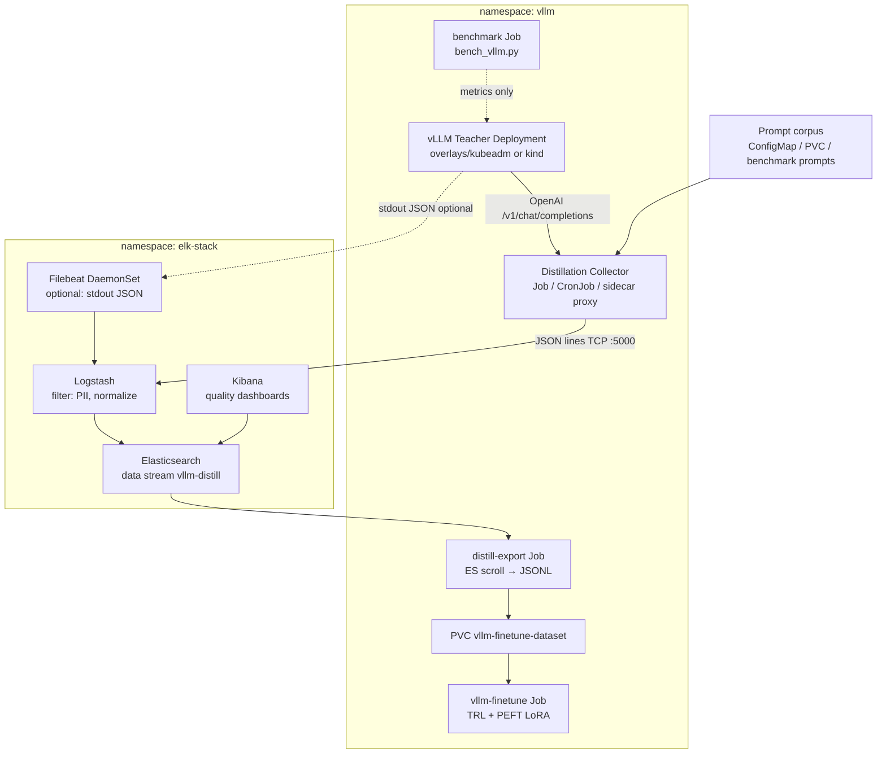
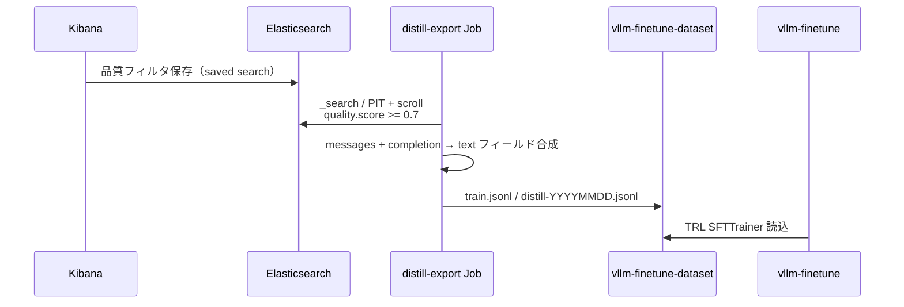

# ELK Stack × vLLM 蒸留（Distillation）統合設計

> 作成日: 2026-06-11  
> ステータス: **P1 実装済み**（Collector + Logstash パイプライン + ES テンプレート/ILM）  
> 対象リポジトリ: `kubernetes/`（`elk-stack/` + `vllm/`）

---

## チーム役割と実施内容

| 役割 | 実施内容 |
|------|----------|
| **Architect** | 既存 `elk-stack/`（ES 9.2.3 単一ノード、Logstash beats/tcp/syslog）と `vllm/`（OpenAI API 推論 + TRL/PEFT LoRA 学習）の境界を定義。蒸留イベント専用データストリーム `vllm-distill` を `logstash-*`（Windows/rsyslog）から分離する案を採用。収集は **構造化 JSON の専用パイプライン**、学習データは **ES → JSONL エクスポート Job** で既存 `vllm-finetune-dataset` PVC に接続。 |
| **DevOps/SRE** | 名前空間 `elk-stack` / `vllm` 間の NetworkPolicy、リソース見積もり（現行 ES heap 256m は蒸留用途には不足）、kind（サンプリング・短期保持）と kubeadm（本番 ILM）の overlay 差分、Argo CD manual sync（`argocd/apps/elk-stack-app.yaml`）との整合を整理。 |
| **ML Engineer** | Teacher（大モデル vLLM）→ Student（小モデル LoRA）のログ項目定義。OpenAI 互換 API の `messages` / `completion` / `usage` / 任意 `logprobs` を正規化。品質フィルタ（長さ、拒否応答、ベンチマーク連携）と `train.jsonl` 形式 `{"text": "..."}` への変換ルールを定義。logits 全量は MVP 外（オブジェクトストア案）。 |
| **Adversarial Critic（反証）** | ELK を蒸留データレイクに使うことの 6+ リスクを列挙（後述）。MVP は「監査・品質ゲート付きサンプル収集」に限定し、大規模蒸留は MinIO + バッチ ETL を推奨。Ollama `qwen2.5:1.5b` でも同趣旨の懸念を確認（コスト・PII・インデックス肥大）。 |
| **Synthesizer** | **推奨: ハイブリッド** — 運用ログ・品質ダッシュボード・フィルタ済みサブセットは ELK、大容量教師出力の正本は PVC/MinIO。既存 ELK を拡張しつつ vLLM 蒸留パイプラインに最小侵襲で接続する段階導入を採択。 |

### Ollama ブレインストーミング

- **使用**: `ollama list` でモデル確認後、`qwen2.5:1.5b` に Architect / Critic 視点のプロンプトを投入。
- **所見**: 汎用的な ELK 統合案は得られたが、本リポジトリ固有の `--disable-log-requests` や finetune JSONL 形式には未言及。**最終設計はコードベース分析を優先**し、Ollama 出力は反証チェックリストの補助に留めた。

### Byterover MCP

- **retrieve-knowledge**: MCP サーバーエラー（Cursor Settings で要確認）。本設計はリポジトリ直接調査に基づく。

---

## 背景と目的

### 現状

| コンポーネント | 状態 |
|----------------|------|
| `elk-stack/` | Logstash ← beats(5044) / tcp+json(5000) / syslog(514) → ES `logstash-%{+YYYY.MM.dd}` |
| `vllm/base/` | `--disable-log-requests` がデフォルト。`VLLM_LOGGING_LEVEL=WARNING` |
| `vllm/components/finetune/` | `train.jsonl`（`{"text":"..."}`）を PVC `/data/dataset` から TRL SFT |
| 蒸留 | **未実装**。ベンチマーク（`vllm/benchmark/`）はレイテンシ JSON のみ |

### 目的

Teacher vLLM の推論結果を **検索・品質フィルタ・監査可能な形で蓄積**し、Student 学習用データセット（JSONL）へエクスポートする。ELK は **ログ基盤の延長**として使い、学習の正本ストアにはしない（Critic 合意）。

---

## アーキテクチャ



### 設計原則

1. **インデックス分離**: 蒸留イベントは `vllm-distill-*`（データストリーム推奨）。既存 `logstash-*` / `winlogbeat-*` と混在しない。
2. **構造化ファースト**: プレーンテキストログの grok 解析に依存しない。Collector がスキーマ付き JSON を送信。
3. **既存 vLLM 推論を壊さない**: Teacher Deployment は原則変更最小。収集は **外部 Collector** または **オプション sidecar**。
4. **overlay 差分**: kind はサンプリング + 短期保持、kubeadm はフルパイプライン + ILM。

---

## 収集対象（Teacher / Collector）

### MVP（必須フィールド）

| フィールド | 型 | 説明 |
|------------|-----|------|
| `@timestamp` | date | イベント時刻 |
| `event.kind` | keyword | `distill.sample` |
| `distill.request_id` | keyword | UUID（重複排除キー） |
| `distill.teacher_model` | keyword | 例: `Qwen/Qwen2.5-1.5B-Instruct` |
| `distill.student_target` | keyword | 蒸留先モデル ID（ラベルのみ） |
| `distill.prompt_hash` | keyword | SHA-256（生 prompt の代用検索キー） |
| `distill.messages` | nested | OpenAI messages（**redacted 後**） |
| `distill.completion` | text | Teacher 応答全文 |
| `distill.finish_reason` | keyword | stop / length / content_filter |
| `distill.usage.prompt_tokens` | integer | |
| `distill.usage.completion_tokens` | integer | |
| `distill.usage.total_tokens` | integer | |
| `distill.latency_ms` | float | E2E |
| `distill.quality.score` | float | 0–1（ルールベース、後述） |
| `distill.quality.flags` | keyword[] | `too_short`, `refusal`, `duplicate` 等 |
| `distill.cluster` | keyword | `kind` / `kubeadm` |
| `kubernetes.namespace` | keyword | `vllm` |

### Full 設計（任意拡張）

| フィールド | 説明 | 備考 |
|------------|------|------|
| `distill.logprobs.top_k` | 先頭 K トークンの logprob | vLLM `logprobs` 対応時のみ。ES には要約のみ |
| `distill.logits_uri` | s3/minio パス | 全 logits は ES に入れない |
| `distill.benchmark.ref` | ベンチマーク run ID | `bench_vllm.py` レポートと突合 |
| `distill.source` | `collector` / `gateway` / `manual` | 収集経路 |

### 収集しないもの（デフォルト）

- API キー、HF_TOKEN、Authorization ヘッダ
- 生の PII（メール、電話、マイナンバー等）— Logstash でマスク
- 全レイヤー logits テンソル（容量・コスト）

---

## インジェスト経路

### 推奨: Distillation Collector → Logstash TCP JSON

既存 `logstash-configmap.yaml` は **tcp/udp port 5000 + json codec** を既に公開。

```
Collector (vllm namespace)
  → Cluster DNS: logstash.elk-stack.svc.cluster.local:5000
  → Logstash filter（PII、quality.score 計算）
  → Elasticsearch data stream: vllm-distill
```

**Collector の実装イメージ**（将来）:

- `vllm/components/distill/distill-collector-job.yaml`
- Prompt リストを ConfigMap から読み、Teacher `http://vllm.vllm.svc:8000` に並列リクエスト
- 1 応答 = 1 JSON 行を Logstash へ送信

### 代替 A: Filebeat（stdout JSON）

Teacher の `VLLM_EXTRA_ARGS` から `--disable-log-requests` を **蒸留専用 overlay のみ**外し、JSON 1 行ログを stdout に出す。Filebeat DaemonSet が `/var/log/containers/*vllm*.log` を tail。

- **利点**: アプリ変更が小さい  
- **欠点**: ログフォーマット不安定、混在ログのパースコスト、Critic 推奨度低

### 代替 B: API Gateway（nginx）アクセスログ

`nginx/` 既存構成に JSON access log を足す方法。prompt/completion 全文は通常含まれないため **MVP には不十分**（メタデータのみ）。

### 採用判断

| 経路 | MVP | Full |
|------|-----|------|
| Collector → Logstash TCP | ✅ 主経路 | ✅ |
| Filebeat stdout | ❌ | △ デバッグ用 |
| Gateway ログ | △ メタのみ | △ |

---

## Elasticsearch スキーマ

- **データストリーム名**: `vllm-distill`（インデックスパターン `vllm-distill-*`）
- **テンプレート**: `elk-stack/design/vllm-distill-index-template.json`（スケッチ）
- **ILM ポリシー**（kubeadm）:
  - hot: 7 日
  - delete: 30 日（蒸留データはエクスポート後に ES から削除可）
- **kind**: hot 3 日 / delete 7 日、サンプリング 10%

`dynamic: strict` を推奨（フィールド爆発防止）。

---

## エクスポートパイプライン（ES → 学習 JSONL）



### JSONL 変換ルール（`train_lora.py` 互換）

```json
{"text": "<|im_start|>user\n{user}\n\n<|im_start|>assistant\n{completion}\n"}
```

- チャットテンプレートは Teacher モデル族（Qwen2.5 等）に合わせ ConfigMap で切替
- `distill-export` は **追記型** `distill-export-*.jsonl` を生成し、オペレータが `train.jsonl` にマージ

### エクスポート Job スケッチ

`elk-stack/design/distill-export-job.yaml.example` — CronJob、ES へは `elasticsearch.elk-stack.svc`、出力は `vllm` PVC への cross-namespace マウントまたは `kubectl cp` / S3 経由。

---

## Kibana ダッシュボード

| パネル | 用途 |
|--------|------|
| 収集量 / 日 | インデックス肥大監視 |
| `quality.flags` 分布 | 低品質除外の効き目 |
| `latency_ms` p50/p99 | Teacher 性能劣化検知 |
| `teacher_model` × `finish_reason` | length 打ち切り過多の検出 |
| エクスポート済み率 | `distill.exported: true` タグ（Full） |

Saved Search 例: `quality.score >= 0.7 AND NOT quality.flags: refusal`

---

## vLLM overlay 統合

| 項目 | kind | kubeadm |
|------|------|---------|
| Teacher モデル | `Qwen2.5-0.5B`（小） | `Qwen2.5-1.5B` 等 |
| 収集レート | 10% サンプル | 100%（または上限 QPS） |
| ES 保持 | 7 日 | 30 日 ILM |
| Collector | 同一 overlay の `components/distill` | 同上 |
| エクスポート先 PVC | `vllm-finetune-dataset`（kind 用小容量） | 本番 PVC |

Kustomize 配置案（将来）:

```
vllm/
├── components/distill/          # Collector Job, ConfigMap prompts
└── overlays/
    ├── kind/distill/            # サンプリング patch
    └── kubeadm/distill/         # フル収集 + export CronJob
```

---

## セキュリティ

| 項目 | 対策 |
|------|------|
| PII | Logstash `fingerprint` + 正規表現マスク（メール/電話）。`distill.prompt_hash` のみ保持オプション |
| 認証 | ES `xpack.security.enabled=true`（現行 deployment 準拠）。Collector / Export Job に ES API Key（K8s Secret） |
| ネットワーク | NetworkPolicy: `vllm` → `elk-stack:5000,9200` のみ許可 |
| 保持 | ILM で自動削除。エクスポート JSONL も PVC ライフサイクルポリシー |
| Secret | ログに HF_TOKEN / API キーを出さない。Collector env は Secret 参照 |

---

## 反証・リスクと対策（Adversarial Critic）

| # | リスク | 影響 | 対策 |
|---|--------|------|------|
| 1 | **インデックス肥大** — 1 サンプル数 KB〜数十 KB、大量蒸留で ES ディスク枯渇 | クラスタ不安定 | データストリーム分離 + ILM、`completion` 長上限、大容量は MinIO URI のみ ES に格納 |
| 2 | **ES リソース不足** — 現行 heap 256m / mem 2Gi は本番蒸留に不適 | 取り込み失敗 | kubeadm では ES を 4Gi+ / heap 1g にパッチ。蒸留はバースト時のみスケールアップ |
| 3 | **PII / 機密プロンプト** | コンプライアンス違反 | 収集前マスク、プロンプト corpus を合成データ中心に、hash-only モード |
| 4 | **レイテンシ** — Collector 同時実行が Teacher GPU を圧迫 | 本番推論劣化 | 収集はオフピーク CronJob、QPS 上限、別 Teacher レプリカ（distill 専用 overlay） |
| 5 | **ELK vs Loki/MinIO** — ログ検索向き ELK、大容量学習データ向きオブジェクトストア | コスト最適化失敗 | **ハイブリッド**: ELK=メタ+品質ゲート、JSONL 正本=PVC/MinIO。Loki は運用ログのみ継続検討（`docs/REDESIGN.md`） |
| 6 | **運用複雑性** — Logstash パイプライン + ILM + Export Job | MTTR 悪化 | スケッチを `elk-stack/design/` に集約、Argo CD は manual sync 維持、Runbook を本 doc に記載 |
| 7 | **`--disable-log-requests` 既定** — Teacher ログが空 | データ欠損 | Collector パターンを主経路に（vLLM 本体は変更不要） |
| 8 | **logits 蒸留の非現実性** — OpenAI API では全 logits 不可 | 研究目的未達 | MVP は出力蒸留（black-box KD）。logits は別途オフライン推論 Job + Parquet on MinIO |

---

## MVP vs Full

| 能力 | MVP | Full |
|------|-----|------|
| 収集 | Collector → Logstash TCP | + Filebeat、専用 Teacher レプリカ |
| インデックス | 手動テンプレート適用 | ILM + data stream 自動ロールオーバー |
| 品質 | ルールベース score | + ベンチマーク連携、人間レビュー Kibana タグ |
| エクスポート | 手動 Job / スクリプト | CronJob → PVC 自動マージ |
| logits | 非対応 | MinIO + 要約メタのみ ES |
| セキュリティ | ES 認証 + 基本マスク | NetworkPolicy、API Key ローテーション |
| overlay | kind のみ試験 | kind + kubeadm |

### MVP の Definition of Done

1. `vllm-distill` テンプレートが ES に適用されている  
2. Collector から 100 件サンプルが Kibana で検索できる  
3. Export で `train.jsonl` 互換 100 行が PVC に生成される  
4. `vllm-finetune` Job がその JSONL で起動できる（スモーク）

---

## 実装ロードマップ（提案）

| Phase | 内容 | 触るパス |
|-------|------|----------|
| P0 設計 | 本ドキュメント + design スケッチ | `docs/design/`, `elk-stack/design/` |
| P1 MVP | index template、Logstash filter 追加、Collector Deployment | `elk-stack/`, `vllm/components/distill/` ✅ |
| P2 エクスポート | export Job、finetune 連携手順 | `vllm/overlays/*/distill/` |
| P3 本番 hardened | ES リソース、ILM、NetworkPolicy | `elk-stack/overlays/kubeadm/`（新設検討） |

---

## 参考（リポジトリ内）

- `elk-stack/logstash-configmap.yaml` — tcp/json 5000 既存
- `elk-stack/elasticsearch-deployment.yaml` — 単一ノード、security on
- `vllm/base/vllm-configmap.yaml` — `--disable-log-requests`
- `vllm/components/finetune/` — `train.jsonl` 形式
- `vllm/benchmark/scripts/bench_vllm.py` — レイテンシ/スループット（蒸留メタと突合可能）
- `argocd/apps/elk-stack-app.yaml` — manual sync
- `argocd/apps/vllm-distill-app.yaml` — kind / kubeadm distill overlays
- `docs/REDESIGN.md` — ELK 維持 + 段階的強化方針

---

## デプロイ手順（P1 実装）

### 1. ELK（Logstash パイプライン + ES テンプレート/ILM）

```bash
kubectl apply -k elk-stack/
kubectl wait --for=condition=complete job/elasticsearch-vllm-distill-setup -n elk-stack --timeout=300s
kubectl rollout restart deployment/logstash -n elk-stack
```

kind クラスタで ILM を 7 日保持に切替える場合:

```bash
kubectl exec -n elk-stack deploy/elasticsearch -- curl -sS -X PUT \
  localhost:9200/_index_template/vllm-distill \
  -H 'Content-Type: application/json' \
  -d '{"index_patterns":["logs-vllm-distill",".ds-logs-vllm-distill-*"],"data_stream":{},"priority":200,"template":{"settings":{"index.lifecycle.name":"vllm-distill-kind"}}}'
```

### 2. Distillation Collector

```bash
# kind（10% サンプル、QPS 0.5）
kubectl apply -k vllm/overlays/kind/distill/

# kubeadm（フル収集、QPS 2）
kubectl apply -k vllm/overlays/kubeadm/distill/
```

前提: `vllm` namespace に Teacher Deployment が稼働、`elk-stack` Logstash が TCP 5000 を待受。

### 3. 確認

```bash
kubectl logs -f deploy/distill-collector -n vllm
kubectl port-forward svc/elasticsearch 9200:9200 -n elk-stack
curl -s 'http://localhost:9200/logs-vllm-distill/_search?size=1&pretty'
```
