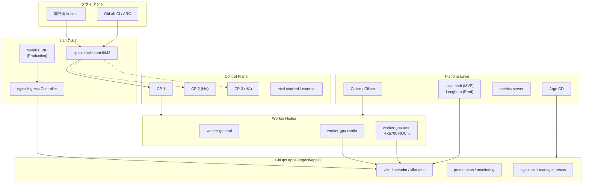
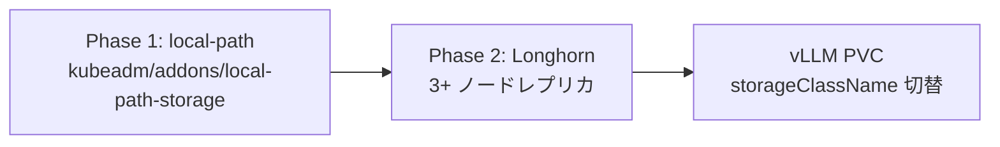
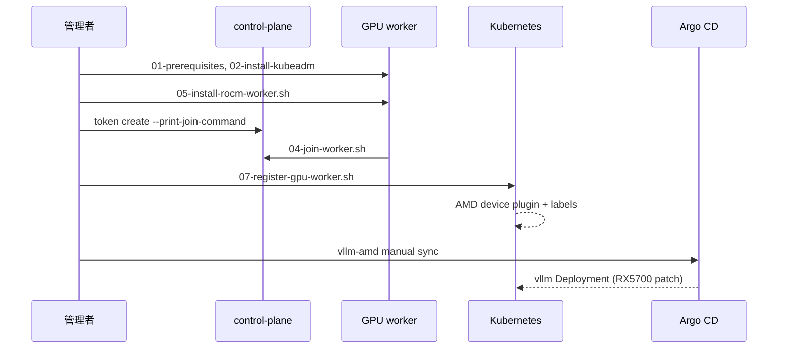

# kubeadm クラスタ設計書

> 作成日: 2026-06-11  
> 対象リポジトリ: [kubernetes](https://github.com/take566/kubernetes)  
> Kubernetes バージョン: **v1.29.15**（`kubeadm/kubeadm-config.yaml`）  
> 関連: [kubeadm/README.md](../kubeadm/README.md), [ARGOCD_SETUP.md](ARGOCD_SETUP.md), [REDESIGN.md](REDESIGN.md)

---

## 1. エグゼクティブサマリー

本ドキュメントは、`D:/work/kubernetes` リポジトリにおける **kubeadm ベース本番クラスタ** の目標アーキテクチャを定義します。現状の `kubeadm/scripts/01–07` と `addons/` は **単一 control-plane（CP）MVP** を想定しており、CNI・local-path・metrics-server・GPU device plugin まで到達可能です。一方、**HA control-plane**、**Ingress/LB の自動化**、**Longhorn**、**MetalLB**、**統一 bootstrap エントリポイント** は未整備です。

設計方針は次のとおりです。

| フェーズ | 目的 | 主要コンポーネント |
|----------|------|-------------------|
| **MVP** | 1 CP + N worker で vLLM / GitOps 検証 | Calico, local-path, nginx Ingress, Argo CD |
| **Production** | 可用性・永続化・LB の本番化 | 3 CP HA, Longhorn, MetalLB, NetworkPolicy, SOPS |

ローカル開発は引き続き [kind/](../kind/README.md) を正とし、kubeadm は **実 GPU（NVIDIA / AMD ROCm）付き Linux ワーカー** と本番相当検証の場とします。アプリケーション定義は Git リポジトリを単一の正（SoT）とし、[scripts/bootstrap.sh](../scripts/bootstrap.sh) + [argocd/apps/](../argocd/apps/) の App of Apps で同期します。

---

## 2. 目標アーキテクチャ



**データフロー要約**

1. 管理者は `controlPlaneEndpoint`（LB VIP または DNS）経由で API Server に接続する。
2. Argo CD が `argocd/apps/` を監視し、vLLM・監視・Ingress 等を同期する。
3. GPU ワークロードは device plugin + nodeSelector で専用ワーカーにスケジュールする。
4. 永続データは MVP では local-path（単一ノード RWO）、本番では Longhorn（レプリカ付き RWO/RWX）へ移行する。

---

## 3. ノードトポロジ

### 3.1 MVP（単一 control-plane）

| ロール | 台数 | スペック目安 | ラベル例 |
|--------|------|-------------|----------|
| control-plane | 1 | 2 vCPU / 4 GiB / 40 GiB disk | `node-role.kubernetes.io/control-plane` |
| worker (general) | 1+ | 4 vCPU / 8 GiB | `workload=general` |
| worker (GPU NVIDIA) | 0–1 | GPU VRAM 要件に依存 | `nvidia.com/gpu.present=true`, `workload=vllm` |
| worker (GPU AMD) | 0–1 | RX 5700 8GB 等 | `amd.com/gpu.present=true`, `workload=vllm-amd` |

- etcd は CP 上に stacked（`kubeadm-config.yaml` の `etcd.local`）。
- CP に `NoSchedule` taint あり。システムコンポーネント以外は worker へ配置。
- **単一 CP は本番 SLA 非対応**。検証・PoC・GPU Teacher 用途に限定する。

### 3.2 Production（HA control-plane）

| ロール | 台数 | 要件 |
|--------|------|------|
| control-plane | **3** | 各 2 vCPU / 4 GiB、anti-affinity |
| worker | 3+ | ワークロードに応じて水平拡張 |
| LB / VIP | 1 | `controlPlaneEndpoint` 前方（HAProxy, kube-vip, クラウド LB） |

**HA 構築手順（目標）**

1. 1 台目: `03-init-control-plane.sh`（`--upload-certs` で証明書共有）
2. 2–3 台目: `kubeadm join --control-plane --certificate-key <key>`
3. `controlPlaneEndpoint` を VIP に向ける（例: `cp.example.com:6443` → `192.168.1.100:6443`）

**現状ギャップ**: `kubeadm/scripts/` に HA 用 join 手順・証明書ローテーション Runbook が未整備（[§10](#10-ギャップ分析現行リポジトリとの差分) 参照）。

### 3.3 ノードラベル・テイント規約

| キー | 値 | 用途 |
|------|-----|------|
| `workload` | `general` / `vllm` / `vllm-amd` | スケジューリング境界 |
| `gpu.vendor` | `nvidia` / `amd` | 運用フィルタ |
| `amd.com/gpu.present` | `true` | device plugin 連携 |
| `nvidia.com/gpu.present` | `true` | NVIDIA device plugin 連携 |

GPU ノードには専用 taint を推奨:

```yaml
# 例: AMD GPU ワーカー
taints:
  - key: amd.com/gpu
    effect: NoSchedule
```

vLLM AMD overlay は `radeon-rx5700-patch.yaml` で toleration を定義済み。

---

## 4. ネットワーク設計

### 4.1 CIDR 計画

`kubeadm/kubeadm-config.yaml` と一致させる。

| 区分 | CIDR | 備考 |
|------|------|------|
| Pod | `192.168.0.0/16` | Calico `CALICO_IPV4POOL_CIDR` と同期 |
| Service | `10.96.0.0/12` | ClusterIP レンジ |
| Node | 環境依存 | 例: `192.168.1.0/24` |

**拡張時の注意**

- Pod CIDR はクラスタ作成後に変更困難。大規模化時は初期設計で `/16` を維持するか、複数クラスタ分割を検討する。
- Service CIDR と社内 LAN の重複を避ける。

### 4.2 CNI 選定

| CNI | 状態 | 用途 |
|-----|------|------|
| **Calico** | **既定**（`05-install-cni.sh`） | MVP / NetworkPolicy 対応 |
| Cilium | オプション（Helm 要） | eBPF, 高度な可観測性が必要な場合 |

```bash
# 既定
sudo kubeadm/scripts/05-install-cni.sh

# Cilium
CNI=cilium sudo kubeadm/scripts/05-install-cni.sh
```

**推奨**: MVP は Calico のまま。NetworkPolicy 本番化時も Calico で足りる。Cilium は運用コスト増に見合う要件がある場合のみ。

### 4.3 Ingress とロードバランサ

| レイヤ | MVP | Production |
|--------|-----|------------|
| L7 Ingress | [nginx/](../nginx/) マニフェスト or Argo CD `nginx-app` | 同上 + cert-manager 連携 |
| L4 LoadBalancer | `NodePort` / `hostNetwork` 回避策 | **MetalLB**（未導入） |
| API Server | `controlPlaneEndpoint` DNS | VIP + 3 CP |

**Ingress 導入（現行）**

```bash
kubectl apply -k nginx/
# または
./scripts/bootstrap.sh   # Argo CD 後に nginx-app が同期
```

**Production 目標**

1. MetalLB で `192.168.1.200–250` 等のプールを割当
2. nginx Ingress Service を `type: LoadBalancer` に変更
3. cert-manager（Argo CD `cert-manager-app`）で TLS 自動化

### 4.4 必須ポート

| ポート | 用途 |
|--------|------|
| 6443 | Kubernetes API |
| 10250 | kubelet |
| 2379–2380 | etcd（CP 間） |
| 179 | Calico BGP（利用時） |
| 80/443 | Ingress |

---

## 5. ストレージ戦略

### 5.1 フェーズ別



| 項目 | local-path（MVP） | Longhorn（Production） |
|------|-------------------|------------------------|
| 導入 | `apply-addons.sh` で同梱 | 別途 Helm / manifest |
| アクセス | RWO, 単一ノード拘束 | RWO / RWX, レプリカ |
| 用途 | 開発・単一 GPU ノード検証 | モデルキャッシュ・finetune データ |
| vLLM overlay | 既定 `storageClassName` | `longhorn` にパッチ |

### 5.2 StorageClass 命名

| StorageClass | provisioner | default |
|--------------|-------------|---------|
| `local-path` | rancher.io/local-path | MVP で default |
| `longhorn` | driver.longhorn.io | Production で default に昇格 |

### 5.3 vLLM データ配置

- 推論キャッシュ: `vllm/overlays/kubeadm/vllm-pvc.yaml`
- AMD 用: `vllm/overlays/kubeadm/amd/vllm-pvc.yaml`
- finetune: `vllm/overlays/kubeadm/finetune-pvc.yaml`

Longhorn 移行時は各 PVC の `storageClassName` を `longhorn` に変更し、既存データは [vllm/overlays/kubeadm/README.md](../vllm/overlays/kubeadm/README.md) の手順で移行する。

---

## 6. Bootstrap シーケンス

### 6.1 フェーズ概要

| Phase | 名称 | 完了条件 |
|-------|------|----------|
| 0 | 計画・設定編集 | `kubeadm-config.yaml` の endpoint / IP 確定 |
| 1 | ノード準備 | 全ノードで `01` + `02` 完了 |
| 2 | CP init | `03-init-control-plane.sh` 成功 |
| 3 | CNI + addons | `05-install-cni.sh` + `apply-addons.sh` |
| 4 | Worker join | `04-join-worker.sh` で N 台参加 |
| 5 | GPU（任意） | `05-install-rocm-worker.sh` + `07-register-gpu-worker.sh` |
| 6 | GitOps | `scripts/bootstrap.sh` + `root-application.yaml` |
| 7 | Production 強化 | HA CP, Longhorn, MetalLB, NetworkPolicy |

### 6.2 MVP 手順（現行スクリプト）

```bash
# === 全ノード ===
sudo kubeadm/scripts/01-prerequisites.sh
sudo kubeadm/scripts/02-install-kubeadm.sh

# === control-plane（1 台目）===
export CONTROL_PLANE_IP=192.168.1.10
export CONTROL_PLANE_DNS=cp.example.com
sudo kubeadm/scripts/03-init-control-plane.sh

# CNI + addons（bootstrap-cluster.sh で一括可）
sudo kubeadm/scripts/bootstrap-cluster.sh
# または個別:
# sudo kubeadm/scripts/05-install-cni.sh
# sudo kubeadm/addons/apply-addons.sh [--with-nvidia|--with-amd]

# === worker ===
kubeadm token create --print-join-command   # CP で実行
sudo kubeadm/scripts/04-join-worker.sh --join 'kubeadm join ...'

# === GitOps ===
./scripts/bootstrap.sh
kubectl apply -f argocd/apps/root-application.yaml   # bootstrap.sh に含まれる

# === Ingress（Argo CD 未使用時）===
kubectl apply -k nginx/
```

### 6.3 Production 追加手順（目標）

1. **HA CP**: 2–3 台目を `--control-plane` で join
2. **MetalLB**: `platform/metallb/`（新規）を Argo CD 管理下に追加
3. **Longhorn**: 3 worker 以上で Helm 導入、default StorageClass 切替
4. **NetworkPolicy**: `policies/` ディレクトリ（新規）を段階適用
5. **Secrets**: SOPS + age で Git 暗号化（[REDESIGN.md](REDESIGN.md) 参照）

### 6.4 統一エントリポイント（目標設計）

現状は `bootstrap-cluster.sh`（CNI + addons）と `scripts/bootstrap.sh`（Argo CD）が分離している。目標はリポジトリルートの **`scripts/bootstrap-platform.sh`**（新規）で次を順序実行すること。

```
kubeadm/scripts/01–03  →  bootstrap-cluster.sh  →  bootstrap.sh  →  validate.sh
```

Windows 開発者向け接続は [kubeadm-connect.md](kubeadm-connect.md) / `scripts/kubeadm-connect.ps1` を継続利用する。

---

## 7. GitOps 統合（Argo CD）

### 7.1 Bootstrap

```bash
./scripts/bootstrap.sh
```

- Argo CD namespace 作成
- upstream `install.yaml` 適用
- `argocd/apps/root-application.yaml` 適用（App of Apps）

`root-application` の `repoURL` / `targetRevision` を本環境の Git リモートに合わせること。

### 7.2 Application 一覧と sync 方針

| Application | Source path | Namespace | Auto sync | 備考 |
|-------------|-------------|-----------|-----------|------|
| `root-application` | `argocd/apps` | argocd | Yes | App of Apps |
| `vllm-kubeadm` | `vllm/overlays/kubeadm` | vllm | Yes | NVIDIA 推論 |
| `vllm-amd` | `vllm/overlays/kubeadm/amd` | vllm | **No** | AMD 推論（排他） |
| `vllm-finetune` | `vllm/overlays/kubeadm/finetune` | vllm | No | 学習 Job |
| `vllm-benchmark` | `vllm/benchmark` | vllm | No | ベンチマーク |
| `nginx` | `nginx` | default | Yes | Ingress |
| `cert-manager` | `cert-manager` | cert-manager | Yes | TLS |
| `prometheus` | `prometheus` | monitoring | Yes | メトリクス |
| `monitoring` | `monitoring` | monitoring | **No** | namespace 競合回避 |
| `nexus` | `nexus` | nexus | Yes | レジストリ |
| `agents` | `agents/hermes` | agents | Yes | エージェント |
| `elk-stack` | `elk-stack` | elk-stack | No | ステートフル |
| `gitlab` | `gitlab` (Helm) | gitlab | No | リソース大 |
| `jenkins` | `jenkins` (Helm) | jenkins | No | CI |

詳細: [ARGOCD_SETUP.md](ARGOCD_SETUP.md), [argocd/apps/DEPRECATED.md](../argocd/apps/DEPRECATED.md)

### 7.3 運用ルール

1. **`vllm-kubeadm` と `vllm-amd` は排他** — 同一 namespace `vllm` で同時 sync しない
2. **`prometheus` と `monitoring` は排他** — 同一 namespace `monitoring`
3. GPU / ステートフル系は **Manual sync** — 意図しない再起動を防ぐ
4. マニフェスト検証: `./scripts/validate.sh`

### 7.4 環境マトリクス

| 環境 | クラスタ | vLLM overlay | GitOps |
|------|----------|--------------|--------|
| ローカル dev | kind | `vllm/overlays/kind` | `vllm-kind-app`（manual） |
| GPU 検証 | kubeadm MVP | `vllm/overlays/kubeadm/amd` | manual |
| 本番 | kubeadm HA | `vllm/overlays/kubeadm` | auto（NVIDIA） |

---

## 8. GPU ワーカー設計

### 8.1 ベンダー別パス

| ベンダー | ホスト準備 | device plugin | vLLM overlay |
|----------|-----------|---------------|--------------|
| NVIDIA | [06-gpu-node-setup.md](../kubeadm/scripts/06-gpu-node-setup.md) | `apply-addons.sh --with-nvidia` | `vllm/overlays/kubeadm` |
| AMD ROCm | `05-install-rocm-worker.sh` | `apply-addons.sh --with-amd` | `vllm/overlays/kubeadm/amd` |

### 8.2 AMD RX 5700（RDNA1 / gfx1010）専用設計

RX 5700 は公式 ROCm サポート外のため、以下の回避策を **必須** とする。

**ホスト（ワーカー）**

```bash
sudo kubeadm/scripts/05-install-rocm-worker.sh --check
sudo kubeadm/scripts/05-install-rocm-worker.sh
echo "HSA_OVERRIDE_GFX_VERSION=10.3.0" | sudo tee -a /etc/environment
source /etc/profile.d/rocm-rx5700.sh
rocminfo | head -40
```

**クラスタ登録（管理者）**

```bash
./kubeadm/scripts/07-register-gpu-worker.sh \
  --node <GPU_NODE_NAME> \
  --vendor amd \
  --apply-vllm \
  --overlay kubeadm/amd
```

**Pod 設定**（`radeon-rx5700-patch.yaml`）

| 項目 | 値 |
|------|-----|
| `HSA_OVERRIDE_GFX_VERSION` | `10.3.0` |
| `PYTORCH_HIP_ALLOC_CONF` | `expandable_segments:True,max_split_size_mb:128` |
| memory requests/limits | 6Gi / 12Gi |
| nodeSelector | `amd.com/gpu.present: "true"` |

### 8.3 GPU ワーカー Bootstrap フロー



Runbook: [GPU_WORKER_JOIN_AMD.md](GPU_WORKER_JOIN_AMD.md)

### 8.4 検証コマンド

```bash
kubectl get nodes -o custom-columns=\
NAME:.metadata.name,\
NVIDIA:.status.allocatable.nvidia\.com/gpu,\
AMD:.status.allocatable.amd\.com/gpu
kubectl get pods -A -l name=amdgpu-dp-ds
kubectl -n vllm get pods -o wide
```

---

## 9. セキュリティベースライン

### 9.1 優先度マトリクス

| 領域 | MVP 最低限 | Production 目標 |
|------|-----------|-----------------|
| RBAC | `cluster-admin` 乱用禁止、名前空間 scoped Role | チーム別 RoleBinding |
| Secrets | Kubernetes Secret（Git に平文禁止） | SOPS + age / External Secrets |
| NetworkPolicy | 未適用可（検証環境） | default-deny + 明示 allow |
| Pod Security | baseline 相当 | restricted へ段階移行 |
| API 公開 | SSH トンネル / プライベート IP | LB + mTLS / OIDC |

### 9.2 RBAC 方針

- **cluster-admin** は break-glass のみ。日常運用は `view` / `edit` を namespace 単位で付与
- Argo CD は AppProject で destination / source 制限
- CI（GitLab Runner / ARC）は専用 ServiceAccount + 最小 Role

### 9.3 Secrets 管理

[REDESIGN.md](REDESIGN.md) の監査結果に基づく。

1. **禁止**: 平文パスワードの Git コミット（`gitlab-secret.yaml` 等）
2. **推奨**: SOPS + age でリポジトリ内暗号化、Argo CD vault プラグイン連携
3. **ローテーション**: join token、Argo CD admin 初期パスワードの早期削除

### 9.4 NetworkPolicy（Production 目標）

段階導入:

| ステップ | 対象 | ポリシー |
|----------|------|----------|
| 1 | `vllm` namespace | Ingress からの 8000/tcp のみ許可 |
| 2 | `monitoring` | Prometheus scrape のみ許可 |
| 3 | `argocd` | Git リポジトリ HTTPS  egress のみ |
| 4 | default | その他 namespace は deny-all から開始 |

Calico 利用時は `NetworkPolicy` API がそのまま使える。

### 9.5 ノードハードニング

`01-prerequisites.sh` で実施済みの項目をベースラインとする。

- swap 無効
- `br_netfilter`, `overlay` モジュール
- containerd + systemd cgroup driver
- kubelet 証明書ローテーション有効

追加推奨: unattended-upgrades、SSH 鍵認証のみ、API Server audit log 有効化。

---

## 10. ギャップ分析（現行リポジトリとの差分）

| 領域 | 現状 | 目標 | 優先度 |
|------|------|------|--------|
| HA control-plane | 単一 CP スクリプトのみ | 3 CP + join Runbook | P1 |
| 統一 bootstrap | `bootstrap-cluster.sh` と `bootstrap.sh` が分離 | 単一 `bootstrap-platform.sh` | P1 |
| Ingress 自動化 | 手動 `kubectl apply -k nginx/` | Argo CD + MetalLB 連携 | P2 |
| MetalLB | 未同梱 | `platform/metallb/` 追加 | P2 |
| Longhorn | README 言及のみ | Helm + StorageClass 切替 | P2 |
| NetworkPolicy | なし | `policies/` 新規 | P2 |
| Secrets | 平文リスク（REDESIGN 指摘） | SOPS 導入 | **P0** |
| HA etcd 外部化 | stacked のみ | 大規模時 external etcd 検討 | P3 |
| Observability 統合 | prometheus / monitoring 競合 | Application 整理 | P2 |
| CI 検証 | `validate.sh` あり | kubeadm パス拡張 | P3 |
| Windows 接続 | `kubeadm-connect.ps1` あり | ドキュメント統合済み | ✅ |
| GPU AMD | `05-install-rocm-worker.sh`, `07-register-gpu-worker.sh` | RX5700 patch 同梱 | ✅ |
| GPU NVIDIA | device plugin addon あり | 06-gpu-node-setup.md | ✅ |
| CNI | Calico 既定 / Cilium オプション | 変更なし | ✅ |
| local-path | addon 同梱 | Longhorn へ移行パス定義 | ✅ |
| Argo CD App of Apps | `root-application.yaml` | repoURL 環境差分のパラメータ化 | P2 |

### 10.1 スクリプト一覧（現行）

| スクリプト | 役割 | 設計上の位置づけ |
|-----------|------|-----------------|
| `01-prerequisites.sh` | OS / containerd 準備 | Phase 1 |
| `02-install-kubeadm.sh` | kubeadm v1.29+ インストール | Phase 1 |
| `03-init-control-plane.sh` | 初回 CP init | Phase 2 |
| `04-join-worker.sh` | worker join | Phase 4 |
| `05-install-cni.sh` | Calico / Cilium | Phase 3 |
| `05-install-rocm-worker.sh` | AMD ROCm（ワーカー） | Phase 5 |
| `06-gpu-node-setup.md` | NVIDIA 手順書 | Phase 5 |
| `07-register-gpu-worker.sh` | GPU 登録 + vLLM 適用 | Phase 5 |
| `bootstrap-cluster.sh` | CNI + addons 一括 | Phase 3（部分統合） |

**欠番・欠落**: `08+` で HA join、Longhorn、MetalLB を追加予定。

---

## 11. 実装チェックリスト（issue サイズのタスク）

以下は GitHub Issue に 1:1 で起票可能な粒度です。ラベル例: `platform`, `kubeadm`, `P0–P3`。

### P0 — セキュリティ（即時）

- [ ] **SEC-001**: リポジトリ内平文 Secret の洗い出しと削除（`gitlab-secret.yaml` 等）
- [ ] **SEC-002**: SOPS + age の導入手順を `docs/secrets-sops.md` に追加
- [ ] **SEC-003**: Argo CD admin 初期パスワード削除手順を Runbook 化

### P1 — クラスタ基盤

- [ ] **KUBE-001**: `docs/kubeadm-ha-control-plane.md` — 3 CP join Runbook（`--upload-certs` 含む）
- [ ] **KUBE-002**: `kubeadm/scripts/08-join-control-plane.sh` — HA 2 台目以降用スクリプト
- [ ] **KUBE-003**: `scripts/bootstrap-platform.sh` — CNI + addons + Argo CD 統合エントリポイント
- [ ] **KUBE-004**: `kubeadm-config.yaml` の環境別 example（`examples/kubeadm-config.prod.yaml`）
- [ ] **KUBE-005**: `controlPlaneEndpoint` 用 HAProxy / kube-vip サンプル manifest

### P2 — ネットワーク・ストレージ

- [ ] **NET-001**: `platform/metallb/` base + IPAddressPool サンプル
- [ ] **NET-002**: `argocd/apps/metallb-app.yaml` 追加（sync: manual）
- [ ] **NET-003**: nginx Ingress Service を LoadBalancer 化する overlay
- [ ] **STG-001**: `platform/longhorn/` Helm values + kustomization
- [ ] **STG-002**: `argocd/apps/longhorn-app.yaml` 追加
- [ ] **STG-003**: vLLM overlay に `storageClassName: longhorn` 用 patch（`longhorn-storage-patch.yaml`）
- [ ] **NET-004**: `policies/vllm-networkpolicy.yaml` — vllm namespace 用

### P2 — GitOps 整理

- [ ] **GIT-001**: `prometheus` vs `monitoring` Application 統合案の ADR
- [ ] **GIT-002**: `root-application.yaml` の `repoURL` を Kustomize helm-style パラメータ化
- [ ] **GIT-003**: `validate.sh` に kubeadm overlay 全パスの `kubectl kustomize` 追加

### P3 — GPU・運用

- [ ] **GPU-001**: NVIDIA 向け `07-register-gpu-worker.sh --vendor nvidia` の E2E テスト手順
- [ ] **GPU-002**: RX 5700 ベンチマーク結果を `vllm/docs/BENCHMARK_RESULTS.md` に追記
- [ ] **OPS-001**: etcd バックアップ cron（`scripts/backup-etcd.sh`）
- [ ] **OPS-002**: Velero 導入検討ドキュメント（Longhorn 連携）

### 完了の定義（Definition of Done）

各タスクは以下を満たすこと。

1. マニフェスト / スクリプトがリポジトリに存在する
2. `kubectl kustomize` または dry-run が成功する
3. 関連 docs が [docs/README.md](README.md) の索引に追記される
4. 可能なら `scripts/validate.sh` に検証パスが追加される

---

## 関連ドキュメント

| ドキュメント | 内容 |
|-------------|------|
| [kubeadm/README.md](../kubeadm/README.md) | Bootstrap 手順（現行） |
| [kubeadm-connect.md](kubeadm-connect.md) | Windows からの kubectl 接続 |
| [GPU_WORKER_JOIN_AMD.md](GPU_WORKER_JOIN_AMD.md) | AMD GPU ワーカー Runbook |
| [ARGOCD_SETUP.md](ARGOCD_SETUP.md) | Argo CD Application 一覧 |
| [vllm/overlays/kubeadm/README.md](../vllm/overlays/kubeadm/README.md) | vLLM ストレージ移行 |
| [REDESIGN.md](REDESIGN.md) | ゼロベース再設計レポート（参考） |
| [kind/README.md](../kind/README.md) | ローカル dev クラスタ |

---

## 改訂履歴

| 日付 | 変更 |
|------|------|
| 2026-06-11 | 初版作成 — MVP / Production 二段階設計、GPU・GitOps・ギャップ分析を統合 |
