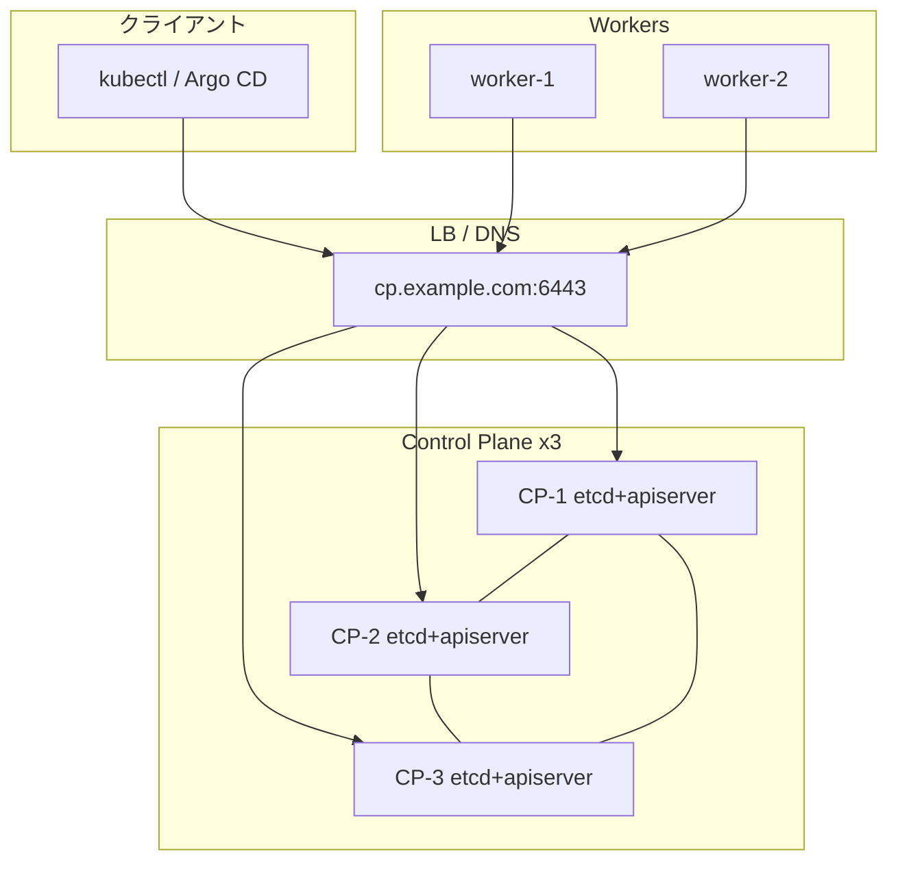

# HA control-plane 構築手順（3 ノード stacked etcd）

本ドキュメントは `kubeadm/` スクリプトを用いて **stacked etcd** 方式の 3 ノード control-plane クラスタを構築するランブックです。

## 前提

| 項目 | 内容 |
|------|------|
| 方式 | stacked etcd（各 CP ノード上に etcd メンバー） |
| 推奨ノード数 | control-plane 3 台 + worker 任意 |
| OS | Ubuntu 22.04/24.04 または Debian 12 |
| エンドポイント | `controlPlaneEndpoint` 用 VIP または DNS（例: `cp.example.com:6443`） |
| スクリプト | `kubeadm/bootstrap.sh`, `kubeadm/scripts/03b-join-control-plane.sh` |

`controlPlaneEndpoint` は **最初の CP ノードの IP ではなく**、ロードバランサまたは DNS で全 CP ノードの API Server に振り分ける必要があります。

## アーキテクチャ概要



## ノード一覧（例）

| ホスト名 | 役割 | IP | 備考 |
|----------|------|-----|------|
| cp-1 | 最初の control-plane | 192.168.1.10 | init + CNI + addons |
| cp-2 | 追加 control-plane | 192.168.1.11 | join-cp |
| cp-3 | 追加 control-plane | 192.168.1.12 | join-cp |
| worker-1 | worker | 192.168.1.20 | join-worker |

## 手順

### 1. 全ノード共通（01 + 02）

各ノードでリポジトリを配置し、前提パッケージと kubeadm をインストールします。

```bash
cd /path/to/kubernetes
sudo kubeadm/scripts/01-prerequisites.sh
sudo kubeadm/scripts/02-install-kubeadm.sh
```

または `bootstrap.sh` の init / join 系ロールが内部で同じフェーズを実行します。

### 2. 最初の control-plane（cp-1）

`kubeadm-config.yaml` の `controlPlaneEndpoint` を LB/DNS に合わせて編集してから init します。

```bash
export CONTROL_PLANE_IP=192.168.1.10
export CONTROL_PLANE_DNS=cp.example.com

sudo kubeadm/bootstrap.sh --role init
# または個別:
# sudo kubeadm/scripts/03-init-control-plane.sh
# sudo kubeadm/scripts/05-install-cni.sh
# sudo kubeadm/addons/apply-addons.sh
```

init 完了後、**証明書キー**と **join コマンド**を控えます。

```bash
# 証明書キー（HA CP join に必須、2 時間で失効）
sudo kubeadm init phase upload-certs --upload-certs

# join トークン + CA ハッシュ
kubeadm token create --print-join-command
```

出力例:

```
[upload-certs] Using certificate key:
a1b2c3d4e5f6...
```

### 3. 追加 control-plane（cp-2, cp-3）

**方法 A: bootstrap.sh（推奨）**

```bash
export CERTIFICATE_KEY='a1b2c3d4e5f6...'   # cp-1 で取得したキー

sudo kubeadm/bootstrap.sh --role join-cp \
  --join-command 'kubeadm join cp.example.com:6443 --token <token> --discovery-token-ca-cert-hash sha256:<hash>'
```

`--certificate-key` フラグでも指定可能:

```bash
sudo kubeadm/bootstrap.sh --role join-cp \
  --join-command 'kubeadm join cp.example.com:6443 --token <token> --discovery-token-ca-cert-hash sha256:<hash>' \
  --certificate-key 'a1b2c3d4e5f6...'
```

**方法 B: 03b スクリプト直接**

```bash
sudo kubeadm/scripts/03b-join-control-plane.sh \
  --join 'kubeadm join cp.example.com:6443 --token <token> --discovery-token-ca-cert-hash sha256:<hash>' \
  --certificate-key 'a1b2c3d4e5f6...'
```

**方法 C: join-config.yaml**

`kubeadm/join-config.yaml.example` をコピーし、`controlPlane.certificateKey` と discovery 値を埋めます。

```bash
cp kubeadm/join-config.yaml.example kubeadm/join-config.yaml
# 編集後:
sudo kubeadm/scripts/03b-join-control-plane.sh --config kubeadm/join-config.yaml
```

### 4. admin kubeconfig

追加 CP ノードにはデフォルトで `admin.conf` が作成されません。既存 CP からコピーするか、クラスタ管理者として配布します。

```bash
scp cp-1:/etc/kubernetes/admin.conf ~/.kube/config-kubeadm
export KUBECONFIG=~/.kube/config-kubeadm
kubectl get nodes -l node-role.kubernetes.io/control-plane
```

### 5. worker 参加

CNI と addons は **最初の CP のみ**で適用済みです。worker は通常どおり参加します。

```bash
sudo kubeadm/bootstrap.sh --role join-worker \
  --join-command 'kubeadm join cp.example.com:6443 --token <token> --discovery-token-ca-cert-hash sha256:<hash>'
```

## `--control-plane` と `--certificate-key` の意味

| フラグ | 用途 |
|--------|------|
| `--control-plane` | ノードを control-plane として参加（stacked etcd メンバー追加） |
| `--certificate-key` | 暗号化された CP 証明書を Secret から復号するキー（`--upload-certs` で発行） |

worker join ではこれらのフラグは **不要** です。HA CP join では **両方必須** です。

証明書キーはセキュリティ上 **2 時間で失効** します。失効後は cp-1 で再度 `kubeadm init phase upload-certs --upload-certs` を実行してください。

## 検証チェックリスト

| 確認項目 | コマンド |
|----------|----------|
| CP ノード数 | `kubectl get nodes -l node-role.kubernetes.io/control-plane` |
| etcd メンバー | `kubectl -n kube-system get pods -l component=etcd` |
| API 到達性 | 各 CP から `curl -k https://cp.example.com:6443/healthz` |
| CNI | `kubectl get pods -n kube-system \| grep -E 'calico\|cilium'` |

## トラブルシューティング

| 症状 | 対処 |
|------|------|
| `certificate key expired` | cp-1 で `kubeadm init phase upload-certs --upload-certs` を再実行し新キーで join |
| join 時 `connection refused` | LB/DNS が全 CP の 6443 に到達できるか確認 |
| CP が 1 台のみ表示 | `--control-plane` 付きで join したか、`certificate-key` が正しいか確認 |
| etcd quorum 喪失 | 過半数の CP が稼働しているか確認（3 ノードなら 2 台以上必要） |

## 関連ファイル

| ファイル | 説明 |
|----------|------|
| `kubeadm/bootstrap.sh` | `--role join-cp` エントリポイント |
| `kubeadm/scripts/03-init-control-plane.sh` | 最初の CP init（`--upload-certs`） |
| `kubeadm/scripts/03b-join-control-plane.sh` | 追加 CP join |
| `kubeadm/join-config.yaml.example` | JoinConfiguration テンプレート |
| `kubeadm/kubeadm-config.yaml` | ClusterConfiguration / InitConfiguration |
